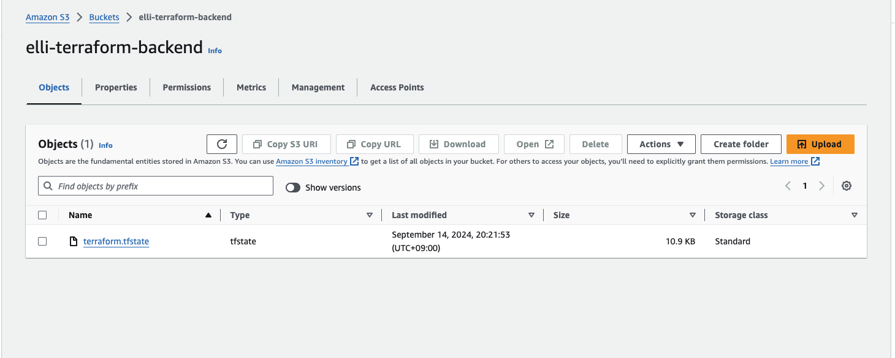
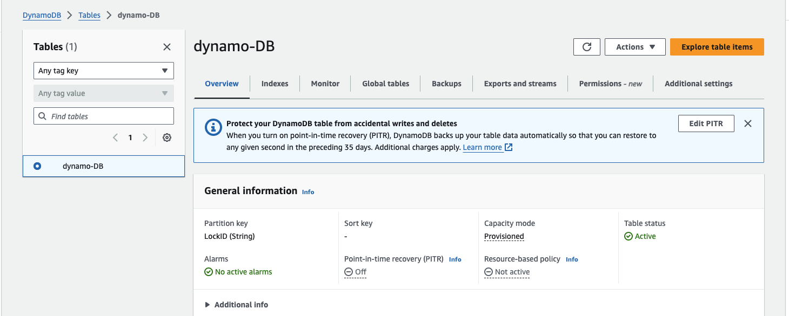

# terraform backend hand-on
## Assignment Requirement
1.Use S3 to store state file <br>
2.Use dynamoDB for locking mechanism of state file. <br>
3.Conclusion for 1&2

# Service that will be using on backend
- S3
- DynamoDB

## Resource that will be created during hand-on
- S3
  - elli-terraform-backend (backend)
  - elli-bucket
- VPC
  - terraform-test-vpc
- Subnet
  - terraform-test-vpc-subnet1
  - terraform-test-vpc-subnet2
- DynamoDB
  - dynamo-DB (backend)

## Hand-on
### AWS iam permission

For aws permission, I have created the IAM user named `terraform-backend` and place inside IAM user group with these permission. Since this is the test purpose, I gave these permission.
- IAM User
  - terraform-backend
- IAM Group
  - terraform-backend
- terraform-backend Group permission
  - AmazonDynamoDBFullAccess
  - AmazonS3FullAccess
  - AmazonVPCFullAccess

### Terraform
Work folder directory.
```
cd 0914
```

Downloading terraform provider
```
terraform init
```
Result
```
Terraform has been successfully initialized!

You may now begin working with Terraform. Try running "terraform plan" to see
any changes that are required for your infrastructure. All Terraform commands
should now work.

If you ever set or change modules or backend configuration for Terraform,
rerun this command to reinitialize your working directory. If you forget, other
commands will detect it and remind you to do so if necessary.
```

**In first terraform, everyone may realise that I have comment out terraform backend to prevent detecting the backend of s3 and dynamoDB existence. If i include backend this error will happen. So, yeh after resource are created, I will turn on the terraform backend.**

```
Error: Failed to get existing workspaces: S3 bucket does not exist.

The referenced S3 bucket must have been previously created. If the S3 bucket
was created within the last minute, please wait for a minute or two and try
again.
```

After terraform init is completed, apply the resources

```
terraform apply
```

<details>
  <summary>terraform apply confirmation</summary>

```
Terraform will perform the following actions:

  # module.dynamodb.aws_dynamodb_table.dynamoDB will be created
  + resource "aws_dynamodb_table" "dynamoDB" {
      + arn              = (known after apply)
      + billing_mode     = "PROVISIONED"
      + hash_key         = "LockID"
      + id               = (known after apply)
      + name             = "dynamo-DB"
      + read_capacity    = 20
      + stream_arn       = (known after apply)
      + stream_label     = (known after apply)
      + stream_view_type = (known after apply)
      + tags_all         = (known after apply)
      + write_capacity   = 20

      + attribute {
          + name = "LockID"
          + type = "S"
        }
    }

  # module.s3.aws_s3_bucket.test_bucket will be created
  + resource "aws_s3_bucket" "test_bucket" {
      + acceleration_status         = (known after apply)
      + acl                         = (known after apply)
      + arn                         = (known after apply)
      + bucket                      = "bucket-elli"
      + bucket_domain_name          = (known after apply)
      + bucket_prefix               = (known after apply)
      + bucket_regional_domain_name = (known after apply)
      + force_destroy               = false
      + hosted_zone_id              = (known after apply)
      + id                          = (known after apply)
      + object_lock_enabled         = (known after apply)
      + policy                      = (known after apply)
      + region                      = (known after apply)
      + request_payer               = (known after apply)
      + tags_all                    = (known after apply)
      + website_domain              = (known after apply)
      + website_endpoint            = (known after apply)
    }

  # module.s3.aws_s3_bucket.tf_bucket will be created
  + resource "aws_s3_bucket" "tf_bucket" {
      + acceleration_status         = (known after apply)
      + acl                         = (known after apply)
      + arn                         = (known after apply)
      + bucket                      = "elli-terraform-backend"
      + bucket_domain_name          = (known after apply)
      + bucket_prefix               = (known after apply)
      + bucket_regional_domain_name = (known after apply)
      + force_destroy               = false
      + hosted_zone_id              = (known after apply)
      + id                          = (known after apply)
      + object_lock_enabled         = (known after apply)
      + policy                      = (known after apply)
      + region                      = (known after apply)
      + request_payer               = (known after apply)
      + tags_all                    = (known after apply)
      + website_domain              = (known after apply)
      + website_endpoint            = (known after apply)
    }

  # module.s3.aws_s3_bucket_versioning.tf_bucket will be created
  + resource "aws_s3_bucket_versioning" "tf_bucket" {
      + bucket = (known after apply)
      + id     = (known after apply)

      + versioning_configuration {
          + mfa_delete = (known after apply)
          + status     = "Enabled"
        }
    }

  # module.vpc.aws_subnet.subnet1 will be created
  + resource "aws_subnet" "subnet1" {
      + arn                                            = (known after apply)
      + assign_ipv6_address_on_creation                = false
      + availability_zone                              = "ap-northeast-1a"
      + availability_zone_id                           = (known after apply)
      + cidr_block                                     = "192.168.0.0/20"
      + enable_dns64                                   = false
      + enable_resource_name_dns_a_record_on_launch    = false
      + enable_resource_name_dns_aaaa_record_on_launch = false
      + id                                             = (known after apply)
      + ipv6_cidr_block_association_id                 = (known after apply)
      + ipv6_native                                    = false
      + map_public_ip_on_launch                        = false
      + owner_id                                       = (known after apply)
      + private_dns_hostname_type_on_launch            = (known after apply)
      + tags                                           = {
          + "Name" = "terraform-test-vpc-subnet1"
        }
      + tags_all                                       = {
          + "Name" = "terraform-test-vpc-subnet1"
        }
      + vpc_id                                         = (known after apply)
    }

  # module.vpc.aws_subnet.subnet2 will be created
  + resource "aws_subnet" "subnet2" {
      + arn                                            = (known after apply)
      + assign_ipv6_address_on_creation                = false
      + availability_zone                              = "ap-northeast-1c"
      + availability_zone_id                           = (known after apply)
      + cidr_block                                     = "192.168.16.0/20"
      + enable_dns64                                   = false
      + enable_resource_name_dns_a_record_on_launch    = false
      + enable_resource_name_dns_aaaa_record_on_launch = false
      + id                                             = (known after apply)
      + ipv6_cidr_block_association_id                 = (known after apply)
      + ipv6_native                                    = false
      + map_public_ip_on_launch                        = false
      + owner_id                                       = (known after apply)
      + private_dns_hostname_type_on_launch            = (known after apply)
      + tags                                           = {
          + "Name" = "terraform-test-vpc-subnet2"
        }
      + tags_all                                       = {
          + "Name" = "terraform-test-vpc-subnet2"
        }
      + vpc_id                                         = (known after apply)
    }

  # module.vpc.aws_vpc.terraform_vpc will be created
  + resource "aws_vpc" "terraform_vpc" {
      + arn                                  = (known after apply)
      + cidr_block                           = "192.168.0.0/16"
      + default_network_acl_id               = (known after apply)
      + default_route_table_id               = (known after apply)
      + default_security_group_id            = (known after apply)
      + dhcp_options_id                      = (known after apply)
      + enable_dns_hostnames                 = (known after apply)
      + enable_dns_support                   = true
      + enable_network_address_usage_metrics = (known after apply)
      + id                                   = (known after apply)
      + instance_tenancy                     = "default"
      + ipv6_association_id                  = (known after apply)
      + ipv6_cidr_block                      = (known after apply)
      + ipv6_cidr_block_network_border_group = (known after apply)
      + main_route_table_id                  = (known after apply)
      + owner_id                             = (known after apply)
      + tags                                 = {
          + "Name" = "terraform-test-vpc"
        }
      + tags_all                             = {
          + "Name" = "terraform-test-vpc"
        }
    }

Plan: 7 to add, 0 to change, 0 to destroy.
```
</details>


```
  Enter a value: yes
```
Terraform resource will be created.
```
Apply complete! Resources: 7 added, 0 changed, 0 destroyed.
```

### 　Enable the backend of terraform

After the resource are created, we uncommenting the `backend` from `version.tf`. And terraform initiate again.

```
terraform init
```
Upon initializing, the confimation will be up and fill yes to enable the backend service of terraform on aws.

```
Initializing the backend...
Do you want to copy existing state to the new backend?
  Pre-existing state was found while migrating the previous "local" backend to the
  newly configured "s3" backend. No existing state was found in the newly
  configured "s3" backend. Do you want to copy this state to the new "s3"
  backend? Enter "yes" to copy and "no" to start with an empty state.

  Enter a value: 
```
After enabled, these text will be shown as its successfully turn on the backup on s3 and terraform lock mechanism on dynamoDB.

```
Successfully configured the backend "s3"! Terraform will automatically
use this backend unless the backend configuration changes.
Initializing modules...

Initializing provider plugins...
- Reusing previous version of hashicorp/aws from the dependency lock file
- Using previously-installed hashicorp/aws v5.66.0

Terraform has been successfully initialized!

You may now begin working with Terraform. Try running "terraform plan" to see
any changes that are required for your infrastructure. All Terraform commands
should now work.

If you ever set or change modules or backend configuration for Terraform,
rerun this command to reinitialize your working directory. If you forget, other
commands will detect it and remind you to do so if necessary.
```

### Checking backup of S3 Terraform.tfstate and lock mechaism on DynamoDB





