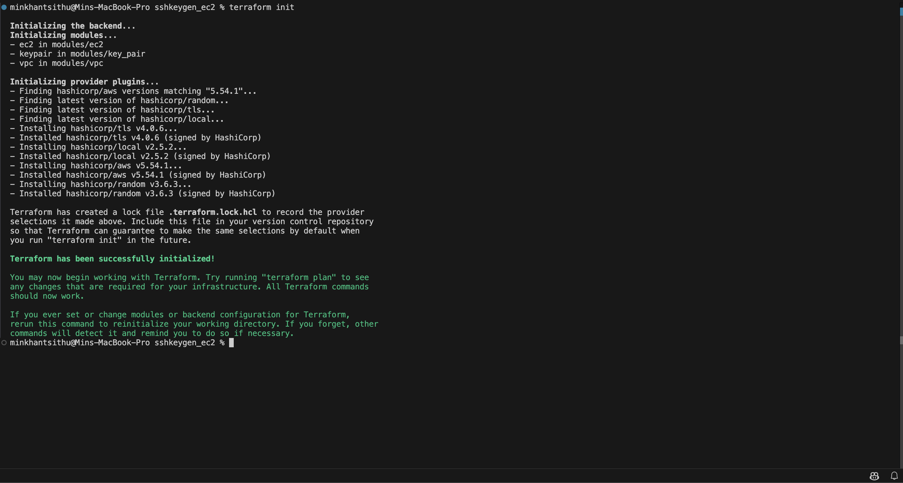
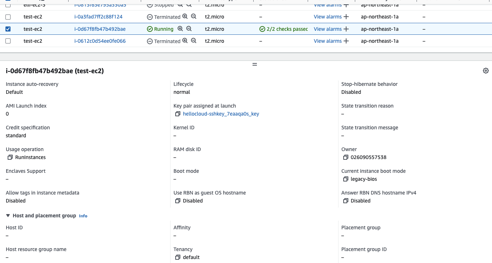
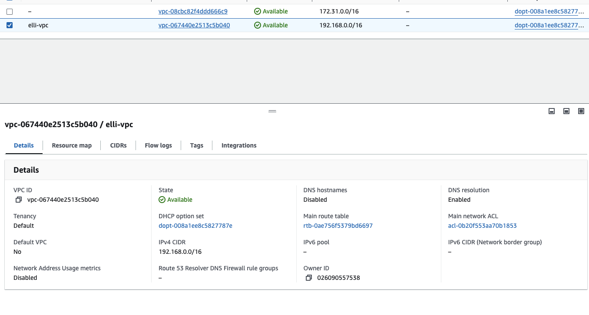
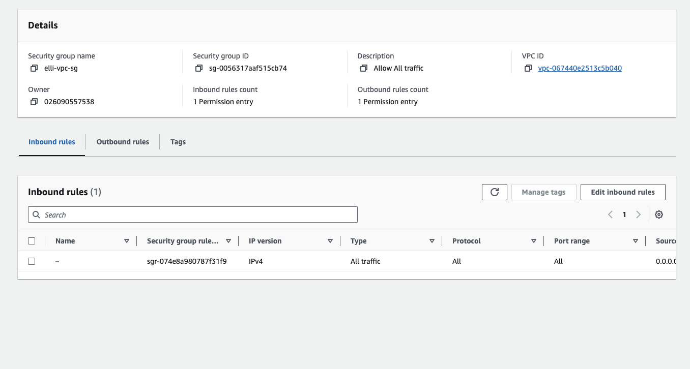
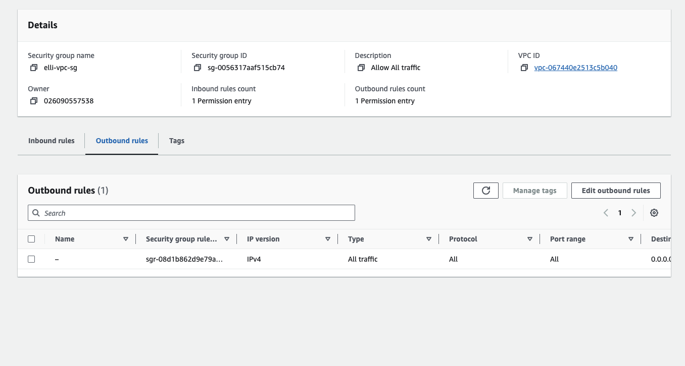
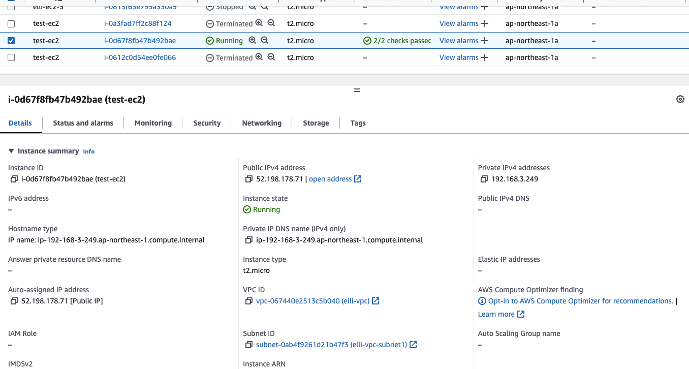
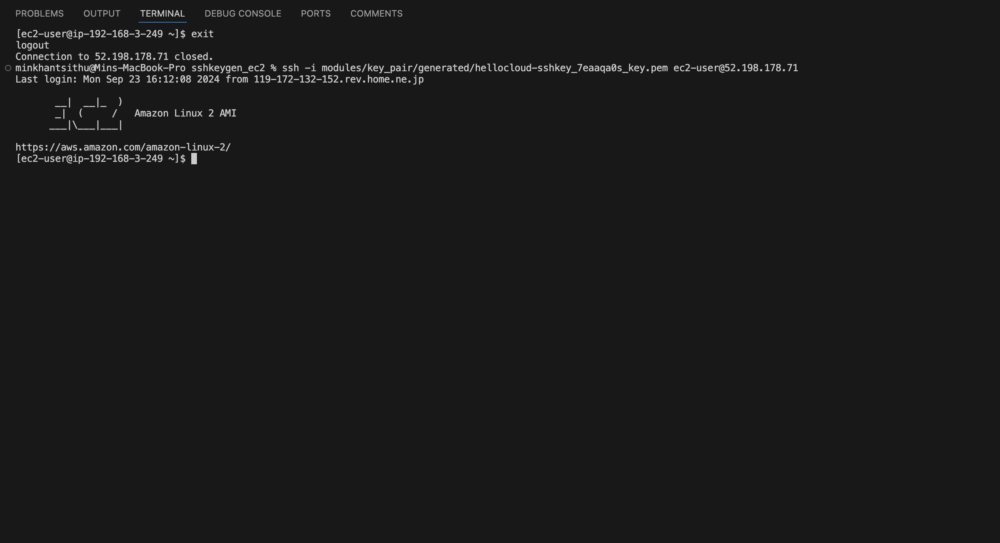

# HelloCloud Assignment: SSH Keygen

## Source Code Link:

[https://github.com/ahiko2/cnfp-assignment/tree/main/terraform assignment/0923/sshkeygen_ec2](https://github.com/ahiko2/cnfp-assignment/tree/main/terraform%20assignment/0923/sshkeygen_ec2)

## Directory Structure

```bash
$ tree

.
└── sshkeygen_ec2
    ├── main.tf
    ├── modules
    │   ├── ec2
    │   │   ├── main.tf
    │   │   ├── output.tf
    │   │   ├── terraform.tfvars
    │   │   └── variable.tf
    │   ├── key_pair
    │   │   ├── generated
    │   │   │   └── hellocloud-sshkey_kg7nygnn_key.pem
    │   │   ├── key-pair.tf
    │   │   ├── output.tf
    │   │   └── variable.tf
    │   └── vpc
    │       ├── main.tf
    │       ├── output.tf
    │       └── variable.tf
    └── versions.tf

```

## Explaination of main.tf

As always, I create the terraform resource in the group of modules and finalize in [main.tf](http://main.tf) as module groups. This time, i create ec2, vpc, key_pair.

If you gonna make additional resource or disable in built, you can always comment out the entire module, so the resource wont be created in aws.

## Before Hand-on

### Changes place

in order to apply the terraform that i wrote, first I would like you to edit 1 place first.

1. [main.tf](http://main.tf) 
    1. ec2 → ami 
        1. ec2 image might be different based on region and the one i using is on ap-northeast-1 (tokyo). So, you are going to apply on another place, make sure to change ami and region.

Hands-on

```bash
cd terraform assignment/0923/sshkeygen_ec2
terraform init
```

We can see the module and providers will be initialized.



Let’s apply the terraform code.

```bash
terraform apply
```

Plan result:

In summary, it show ec2 instance, vpc things and key_pair will be created.

```bash
Terraform will perform the following actions:

  # module.ec2.aws_instance.test_ec2 will be created
  + resource "aws_instance" "test_ec2" {
      + ami                                  = "ami-09ebacdc178ae23b7"
      + arn                                  = (known after apply)
      + associate_public_ip_address          = true
      + availability_zone                    = (known after apply)
      + cpu_core_count                       = (known after apply)
      + cpu_threads_per_core                 = (known after apply)
      + disable_api_stop                     = (known after apply)
      + disable_api_termination              = (known after apply)
      + ebs_optimized                        = (known after apply)
      + get_password_data                    = false
      + host_id                              = (known after apply)
      + host_resource_group_arn              = (known after apply)
      + iam_instance_profile                 = (known after apply)
      + id                                   = (known after apply)
      + instance_initiated_shutdown_behavior = (known after apply)
      + instance_lifecycle                   = (known after apply)
      + instance_state                       = (known after apply)
      + instance_type                        = "t2.micro"
      + ipv6_address_count                   = (known after apply)
      + ipv6_addresses                       = (known after apply)
      + key_name                             = (known after apply)
      + monitoring                           = (known after apply)
      + outpost_arn                          = (known after apply)
      + password_data                        = (known after apply)
      + placement_group                      = (known after apply)
      + placement_partition_number           = (known after apply)
      + primary_network_interface_id         = (known after apply)
      + private_dns                          = (known after apply)
      + private_ip                           = (known after apply)
      + public_dns                           = (known after apply)
      + public_ip                            = (known after apply)
      + secondary_private_ips                = (known after apply)
      + security_groups                      = (known after apply)
      + source_dest_check                    = true
      + spot_instance_request_id             = (known after apply)
      + subnet_id                            = (known after apply)
      + tags                                 = {
          + "Name" = "test-ec2"
        }
      + tags_all                             = {
          + "Name" = "test-ec2"
        }
      + tenancy                              = (known after apply)
      + user_data                            = (known after apply)
      + user_data_base64                     = (known after apply)
      + user_data_replace_on_change          = false
      + vpc_security_group_ids               = (known after apply)
    }

  # module.keypair.aws_key_pair.aws_key_pair will be created
  + resource "aws_key_pair" "aws_key_pair" {
      + arn             = (known after apply)
      + fingerprint     = (known after apply)
      + id              = (known after apply)
      + key_name        = (known after apply)
      + key_name_prefix = (known after apply)
      + key_pair_id     = (known after apply)
      + key_type        = (known after apply)
      + public_key      = (known after apply)
      + tags            = {
          + "Name" = "ec2-keypair"
        }
      + tags_all        = {
          + "Name" = "ec2-keypair"
        }
    }

  # module.keypair.local_file.private_key will be created
  + resource "local_file" "private_key" {
      + content              = (sensitive value)
      + content_base64sha256 = (known after apply)
      + content_base64sha512 = (known after apply)
      + content_md5          = (known after apply)
      + content_sha1         = (known after apply)
      + content_sha256       = (known after apply)
      + content_sha512       = (known after apply)
      + directory_permission = "0777"
      + file_permission      = "0777"
      + filename             = (known after apply)
      + id                   = (known after apply)
    }

  # module.keypair.random_string.suffix will be created
  + resource "random_string" "suffix" {
      + id          = (known after apply)
      + length      = 8
      + lower       = true
      + min_lower   = 0
      + min_numeric = 0
      + min_special = 0
      + min_upper   = 0
      + number      = true
      + numeric     = true
      + result      = (known after apply)
      + special     = false
      + upper       = true
    }

  # module.keypair.tls_private_key.ssh will be created
  + resource "tls_private_key" "ssh" {
      + algorithm                     = "RSA"
      + ecdsa_curve                   = "P224"
      + id                            = (known after apply)
      + private_key_openssh           = (sensitive value)
      + private_key_pem               = (sensitive value)
      + private_key_pem_pkcs8         = (sensitive value)
      + public_key_fingerprint_md5    = (known after apply)
      + public_key_fingerprint_sha256 = (known after apply)
      + public_key_openssh            = (known after apply)
      + public_key_pem                = (known after apply)
      + rsa_bits                      = 2048
    }

  # module.vpc.aws_internet_gateway.gw will be created
  + resource "aws_internet_gateway" "gw" {
      + arn      = (known after apply)
      + id       = (known after apply)
      + owner_id = (known after apply)
      + tags     = {
          + "Name" = "elli-vpc-igw"
        }
      + tags_all = {
          + "Name" = "elli-vpc-igw"
        }
      + vpc_id   = (known after apply)
    }

  # module.vpc.aws_route_table.test_route_table will be created
  + resource "aws_route_table" "test_route_table" {
      + arn              = (known after apply)
      + id               = (known after apply)
      + owner_id         = (known after apply)
      + propagating_vgws = (known after apply)
      + route            = [
          + {
              + carrier_gateway_id         = ""
              + cidr_block                 = "0.0.0.0/0"
              + core_network_arn           = ""
              + destination_prefix_list_id = ""
              + egress_only_gateway_id     = ""
              + gateway_id                 = (known after apply)
              + ipv6_cidr_block            = ""
              + local_gateway_id           = ""
              + nat_gateway_id             = ""
              + network_interface_id       = ""
              + transit_gateway_id         = ""
              + vpc_endpoint_id            = ""
              + vpc_peering_connection_id  = ""
            },
        ]
      + tags             = {
          + "Name" = "elli-vpc-public-rt"
        }
      + tags_all         = {
          + "Name" = "elli-vpc-public-rt"
        }
      + vpc_id           = (known after apply)
    }

  # module.vpc.aws_route_table_association.public_subnet_1 will be created
  + resource "aws_route_table_association" "public_subnet_1" {
      + id             = (known after apply)
      + route_table_id = (known after apply)
      + subnet_id      = (known after apply)
    }

  # module.vpc.aws_security_group.elli-vpc-sg will be created
  + resource "aws_security_group" "elli-vpc-sg" {
      + arn                    = (known after apply)
      + description            = "Allow All traffic"
      + egress                 = [
          + {
              + cidr_blocks      = [
                  + "0.0.0.0/0",
                ]
              + description      = ""
              + from_port        = 0
              + ipv6_cidr_blocks = []
              + prefix_list_ids  = []
              + protocol         = "-1"
              + security_groups  = []
              + self             = false
              + to_port          = 0
            },
        ]
      + id                     = (known after apply)
      + ingress                = [
          + {
              + cidr_blocks      = [
                  + "0.0.0.0/0",
                ]
              + description      = ""
              + from_port        = 0
              + ipv6_cidr_blocks = []
              + prefix_list_ids  = []
              + protocol         = "-1"
              + security_groups  = []
              + self             = false
              + to_port          = 0
            },
        ]
      + name                   = "elli-vpc-sg"
      + name_prefix            = (known after apply)
      + owner_id               = (known after apply)
      + revoke_rules_on_delete = false
      + tags_all               = (known after apply)
      + vpc_id                 = (known after apply)
    }

  # module.vpc.aws_subnet.subnet1 will be created
  + resource "aws_subnet" "subnet1" {
      + arn                                            = (known after apply)
      + assign_ipv6_address_on_creation                = false
      + availability_zone                              = "ap-northeast-1a"
      + availability_zone_id                           = (known after apply)
      + cidr_block                                     = "192.168.0.0/20"
      + enable_dns64                                   = false
      + enable_resource_name_dns_a_record_on_launch    = false
      + enable_resource_name_dns_aaaa_record_on_launch = false
      + id                                             = (known after apply)
      + ipv6_cidr_block_association_id                 = (known after apply)
      + ipv6_native                                    = false
      + map_public_ip_on_launch                        = false
      + owner_id                                       = (known after apply)
      + private_dns_hostname_type_on_launch            = (known after apply)
      + tags                                           = {
          + "Name" = "elli-vpc-subnet1"
        }
      + tags_all                                       = {
          + "Name" = "elli-vpc-subnet1"
        }
      + vpc_id                                         = (known after apply)
    }

  # module.vpc.aws_vpc.main_vpc will be created
  + resource "aws_vpc" "main_vpc" {
      + arn                                  = (known after apply)
      + cidr_block                           = "192.168.0.0/16"
      + default_network_acl_id               = (known after apply)
      + default_route_table_id               = (known after apply)
      + default_security_group_id            = (known after apply)
      + dhcp_options_id                      = (known after apply)
      + enable_dns_hostnames                 = (known after apply)
      + enable_dns_support                   = true
      + enable_network_address_usage_metrics = (known after apply)
      + id                                   = (known after apply)
      + instance_tenancy                     = "default"
      + ipv6_association_id                  = (known after apply)
      + ipv6_cidr_block                      = (known after apply)
      + ipv6_cidr_block_network_border_group = (known after apply)
      + main_route_table_id                  = (known after apply)
      + owner_id                             = (known after apply)
      + tags                                 = {
          + "Name" = "elli-vpc"
        }
      + tags_all                             = {
          + "Name" = "elli-vpc"
        }
    }

Plan: 11 to add, 0 to change, 0 to destroy.
```

Then yes

```bash
module.keypair.random_string.suffix: Creating...
module.keypair.tls_private_key.ssh: Creating...
module.keypair.random_string.suffix: Creation complete after 0s [id=7eaaQA0S]
module.keypair.tls_private_key.ssh: Creation complete after 0s [id=58d70e1d86d9dc21d2fe94fe23804b18ba62144b]
module.keypair.local_file.private_key: Creating...
module.keypair.local_file.private_key: Provisioning with 'local-exec'...
module.keypair.local_file.private_key (local-exec): Executing: ["/bin/sh" "-c" "chmod 400 modules/key_pair/generated/hellocloud-sshkey_7eaaqa0s_key.pem"]
module.keypair.local_file.private_key: Creation complete after 0s [id=902e5bcac65de9da6f04341afbcd5536d4ac8af7]
module.keypair.aws_key_pair.aws_key_pair: Creating...
module.vpc.aws_vpc.main_vpc: Creating...
module.keypair.aws_key_pair.aws_key_pair: Creation complete after 1s [id=hellocloud-sshkey_7eaaqa0s_key]
module.vpc.aws_vpc.main_vpc: Creation complete after 3s [id=vpc-067440e2513c5b040]
module.vpc.aws_internet_gateway.gw: Creating...
module.vpc.aws_subnet.subnet1: Creating...
module.vpc.aws_security_group.elli-vpc-sg: Creating...
module.vpc.aws_internet_gateway.gw: Creation complete after 1s [id=igw-0332627bf45771f82]
module.vpc.aws_route_table.test_route_table: Creating...
module.vpc.aws_subnet.subnet1: Creation complete after 1s [id=subnet-0ab4f9261d21b47f3]
module.vpc.aws_route_table.test_route_table: Creation complete after 1s [id=rtb-011793a8b73b201d3]
module.vpc.aws_route_table_association.public_subnet_1: Creating...
module.vpc.aws_route_table_association.public_subnet_1: Creation complete after 0s [id=rtbassoc-0f12dd1fbf6d89dd5]
module.vpc.aws_security_group.elli-vpc-sg: Creation complete after 3s [id=sg-0056317aaf515cb74]
module.ec2.aws_instance.test_ec2: Creating...
module.ec2.aws_instance.test_ec2: Still creating... [10s elapsed]
module.ec2.aws_instance.test_ec2: Creation complete after 13s [id=i-0d67f8fb47b492bae]

Apply complete! Resources: 11 added, 0 changed, 0 destroyed.
```

So, terraform apply is completed and lets check on aws resources.

### Checking Resources

Key-pair



VPC



Security Group





EC2




Resources are now created and lets see if we could access to that ec2.

```bash
ssh -i modules/key_pair/generated/hellocloud-sshkey_7eaaqa0s_key.pem ec2-user@52.198.178.71
```




Now we got access to ec2 with ssh key.

After hands-on

Make sure to delete all resoucre once you are done with ur testing and playground subject

```bash
terraform destroy -auto-approve
```